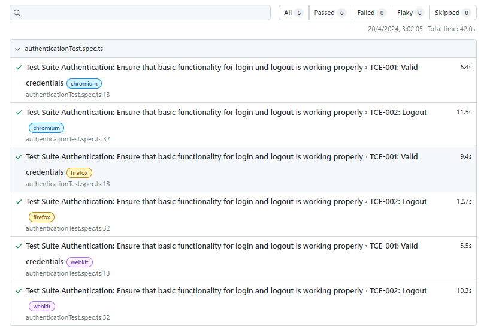
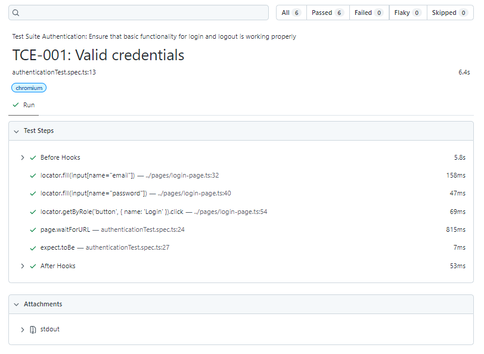

# QA automation challenge
This is an automation test project for a website focused on the management of invoices, estimates, payments and expenses using Playwright and Typescript.

## Table of contents
* [General Info](#general-info)
* [Technologies](#technologies)
* [Setup](#setup)
* [Launch](#launch)
* [Reporter Screenshots](#reporter-screenshots)
* [Report of all test](#all-test-report)
* [Detail of one test](#detail-test-report)


## General Info
This project is about automated UI tests with Playwright and Typescript, using the design pattern **POM (page object model)**. The system tested is a finance administrative web site.


## Technologies
Project is created with:

- Node.js v20.12.2.
- Typescript v4.9.5.
- Playwright v1.43.1.


## Setup
Clone the repository to a directory of your convenience. One way to do this is through console commands.

```bash
cd <project directory name>
git clone <repository URL>
```

## Launch
After you clone this repo you need to install its dependencies, for this go to the root directory of the repository and using the console run:
```bash
npm install 
```

Once the dependencies are installed, you can run some of these commands:

- `npm run test.auth`: it is used to run the "npx playwright test authenticationTest.spec.ts" command (this is configured in package.json file), which will execute all the tests described in the *authenticationTest.spec.ts* file in the Chrome, Firefox and Webkit browsers.
- `npm run test.h.auth`: it is used to run the "npx playwright test authenticationTest.spec.ts --project chromium --headed" command (this is configured in package.json file), which will execute all the tests described in the *authenticationTest.spec.ts* file in the Chrome browser in head mode.

## Reporter Screenshots
After running the test a HTML report will be generated, to see it run the command `npx playwright show-report` or `npm run report` . Here are some screenshots of the report:

### Report of all test


### Detail of one test
